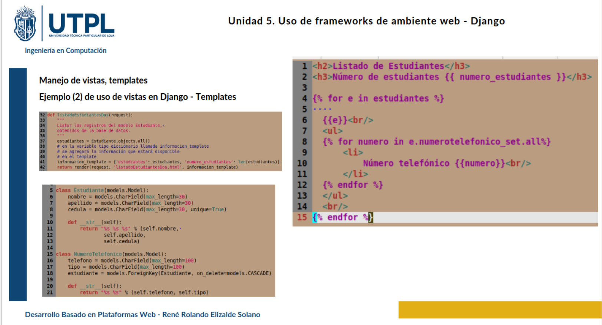

# clase03-2bim

si no pongo related_name django por defecto me crea el nombre del modelo en minúscula seguido de guion bajo set por eso tengo que usar numerotelefonico_set para acceder a los números del estudiante si pongo un related_name ya puedo usar ese nombre que yo le haya dado

### 25 junio 2025

* Primero se obtiene al estudiante usando su id y lo guarda en una variable
Después creo el formulario NumeroTelefonicoEstudianteForm y pasa ese estudiante
En el init del form oculta el campo estudiante con HiddenInput para que no pueda modificarse
Si la petición es POST revisa que el formulario sea válido guarda el nuevo número y regresa al inicio
Si la petición es GET solo muestra el formulario con la referencia al estudiante ya cargada
De esta manera se añade un número telefónico al registro del alumno